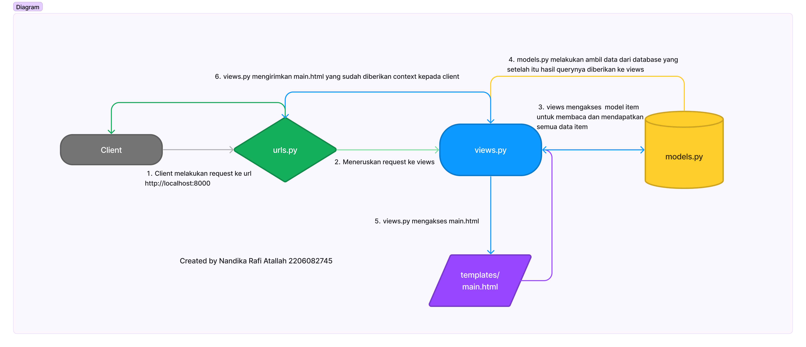

## Nandika Rafi Atallah
## PBP C
## 2206082745
Tugas 2
tautan : https://sectask-nandika.adaptable.app/main/

1.Jelaskan bagaimana cara kamu mengimplementasikan checklist di atas secara step-by-step !
Pertama, sebelum proyek Django dibuat, saya terlebih dahulu membuat direktori baru dengan nama nandika_inventory. Direktori tersebut saya buat untuk menyimpan data-data tugas 2 saya. 

Selanjutnya saya membuka command prompt dari direktori nandika_inventory untuk mengaktifkan virtual environment. Tujuan dari pengaktifan virtual environment adalah mengisolasi package serta dependencies dari aplikasi sehingga tidak terjadi tabrakan dengan versi lain yang ada pada komputer. Adapun cara pengaktifannya dengan perintah berikut.

env\Scripts\activate.bat

Setelah itu, saya akan menyiapkan dependencies yang tujuannya agar suatu perangkat lunak dapat berfungsi dengan baik termasuk library, framework, atau package. Dependencies yang saya buat saya letakkan pada berkas requirements.txt yang ada di dalam direktori nandika_inventory.

Adapun isi dari dependencies tersebut adalah
django
gunicorn
whitenoise
psycopg2-binary
requests
urllib3

Setelah isinya dibuat, dependencies tersebut harus dipasang dengan menjalankan perintah di command prompt 
pip install -r requirements.txt

Setelah hal tersebut dilakukan, saya dapat membuat proyek Django baru bernama nandika_project dengan perintah berikut.
django-admin startproject nandika_project .

Setelah membuat proyek Django baru, saya harus menambahkan * pada ALLOWED_HOST di settings.py untuk keperluan deployment yang membuat aplikasi dapat diakses secara luas. Disini ALLOWED_HOST memiliki fungsi sebagai daftar host yang diizinkan untuk dapat mengakses aplikasi web. 

Kemudian, saya harus menjalankan server Django dengan perintah
python manage.py runserver

Setelah itu, saya mengecek ke http://localhost:8000/ untuk mengetahui apakah aplikasi Django yang saya buat sudah berhasil.
Kemudian pada direktori nandika_inventory, saya membuat berkas .gitignore yang digunakan dalam repositori Git untuk menentukan berkas-berkas dan direktori-direkori yang harus diabaikan oleh Git. Berkas ini berfungsi karena pasti ada berkas-berkas yang tidak perlu dilacak oleh Git seperti berkas hasil proses kompilasi, berkas sementara, ataupun berkas konfigurasi pribadi. Adapun isi berkas .gitignore dapat dilihat pada berkas tersebut.

Tahap kedua yang saya lakukan adalah membuat aplikasi main dalam proyek nandika_project dengan perintah berikut.
python manage.py startapp main
Setelah itu, saya harus mendaftarkan aplikasi main ke dalam proyek dengan membuka berkas settings.py di dalam direktori proyek nandika_project. Saya harus menemukan variable INSTALLED_APPS dan menambahkan ‘main’ ke dalam daftar aplikasi yang ada.
Setelah itu saya harus mengatur routing URL agar aplikasi main yang telah saya buat dapat diakes melalui peramban web dengan membuat berkas urls.py di dalam direktori main. Adapun isi dari urls.py diisi dengan kode berikut.

from django.urls import path
from main.views import show_main

app_name = 'main'

urlpatterns = [
    path('', show_main, name='show_main'),
]

Tujuan dari membuat urls.py adalah untuk mengatur rute URL yang terkait dengan aplikasi main. Impor path dan django.urls  digunakan untuk mendefinisikan pola URL. Fungsi show_main dari modul main digunakan sebagai tampilan yang akan ditampilkan saat URL diakses. Variabel app_name diberikan untuk memberikan nama unik pada pola URL dalam aplikasi.
Selanjutnya, saya akan mengonfigurasi routing URL protek dengan menambahkan rute URL dalam urls,py yang ada di dalam direktori proyek nandika_project. Berkas urls.py pada proyek dibuat untuk bertanggung jawab untuk mengatur rute URL pada tingkat proyek. Pada kode, saya tambahkan
from django.urls import path, include
dengan tujuan untuk mengimpore rute URL dari aplikasi lain ke dalam berkas urls.py.
Saya juga menambahkan rute URL seperti berikut.

urlpatterns = [
    ...
    path('main/', include('main.urls')),
    ...
]

dengan tujuan untuk mendefinisikan dalam berkasi urls.py aplikasi main. 

Kemudian, saya mengisi berkas models.py untuk mendefinisikan atribut dengan tipe datanya. Adapun isi berkas models.py saya sebagai berikut.

from django.db import models

class Item(models.Model):
    name = models.CharField(max_length=255)
    amount = models.IntegerField()
    description = models.TextField()
    price = models.IntegerField()

Dari kode tersebut saya mendefinisikan Item sebagai nama model. Lalu name, amount, description, dan price adalah atribut yang saya definisikan juga sesuai dengan instruksi soal.

Setelah itu, saya membuat sebuah fungsi pada views.py yang bertujuan untuk dikembalikan ke dalam sebuah template HTML yang menampilkan aplikasi yang saya buat. Saya mengisi kode berikut pada berkas views.py
from django.shortcuts import render

#Create your views here.
def show_main(request):
    context = {
        'name': 'Tas Sekolah',
        'harga': 'Rp. 50.000',
        'description': 'Tas merupakan jenis ransel yang diproduksi di Indonesia. Tas memiliki banyak varian warna. Terdapat bonus berupa jas hujan sebagai pelindung tas dari hujan ',
        'amount': 25,
    }

    return render(request, "main.html", context)

context adalah dictionary yang berisi data yang akan dikirimkan ke tampilan. return render berguna untuk merender tampilan main.html dengan menggunakan fungsi render. Terdapat 3 argumen dalam fungsi render yaitu request yang berupa objek permintaan HTTP yang dikirim oleh user, main.html yang akan saya buat merupakan nama berkas template yang akan me-render tampilan, dan context berisi dictionary yang berisi data yang akan terus diteruskan ke tampilan sebagai penampilan dinamis.

Setelah itu, saya baru membuat direktori baru bernama templates di dalam direktori aplikasi main. Di dalam direktori templates, saya membuat file baru bernama main.html yang merupakan salah satu argument dalam fungsi render yang saya jelaskan sebelumnya. Adapun inti isi main.html saya sebagai berikut.
<!DOCTYPE html>
<html>
<head>
<style>
</style>
</head>
<body>

<div class="center-text">
  <h1 id="text"><b>Nandika's Inventories</b></h1>
  <h2 id="text">Sedia Perlengkapan Sekolah</h2>
  <h5 id="text">Nama Item : </h5>
  <p id="text">{{ name }}</p>
  <h5 id="text">Harga : </h5>
  <p id="text">{{ harga }}</p>
  <h5 id="text">Jumlah Barang : </h5>
  <p id="text">{{ amount }}</p>
  <h5 id="text">Deskripsi </h5>
  <p id="text">
    {{ description }}
  </p>

</div>
</body>
</html>

Saya juga mengatur color, font, text, dan sebagainya yang dapat dilihat diberkas saya. Sintaks Django {{ name }}, {{ harga }}. {{ amount }}, dan {{ description }} digunakan untuk menampilkan nilai dari variable yang telah didefinisikan dalam context yang ada pada fungsi show_main.
Setelah saya melakukan pengaturan pada views.py, main.html, urls.py dan sebagainya, saya membuat repositori Github baru bernama nandika_inventory dengan visibilitas public. Setelah itu, saya menjalankan migrasi model untuk  melakukan perubahan model yang saya lakukan dengan perintah berikut.
python manage.py makemigrations
python manage.py migrate

Perintah makemigrations menciptakan perubahan model yang belum diaplikasikan ke dalam basis data, sedangkan migrate mengaplikasikan perubahan model yang telah tercantum dalam basis data.
Selain step-step yang diinstruksikan, saya juga membuat unit test dengan membuat berkas tests.py pada direktori aplikasi main. Isi kode test.py dapat dilihat di berkas tests.py. Kode test_main_url_is_exist adalah tes untuk mengecek apakah path URL /main/ dapat diakses, sedangkan kode test_main_using_main_template adalah tes yang digunakan untuk mengecek apakah halaman /main/ di-render menggunakan template main.html.  Lalu, saya menjalankan test dengan perintah
python manage.py test

dan tes berhasil dilakukan.
Kemudian, saya menonaktifkan virtual environment dengan perintah deactivate. Setelah mengaktifkan virtual environment, saya melakukan init, add, commit, push berkas-berkas saya yang ada pada direktori nandika_inventory ke repository nandika_inventory yang ada pada GitHub. Adapun instruksi yang saya berikan saya berikut.
it init
git add . 
git commit -m "commit"
git branch -M main
git remote add origin “link github saya”
git push -u origin main

Agar tampilan saya dapat dilihat oleh orang lain, saya harus melakukan deployment ke Adaptable terhadap aplikasi yang sudah dibuat. Adapun cara melakukan deployment ke Adaptable adalah sebagai berikut.
1.Pertama, saya harus membuat akun adaptable,io menggunakan akun GitHub
2.Setelah itu login, dan pilih New App. Lalu pilih Connect an Existing Repository.
3.Lalu saya pilih repository nandika_inventory yang isi-isinya merupakan berkas-berkas yang saya push dari direktori saya
4.Kemudian saya memilih branch main
5.Setelah itu, saya memilih Python App Template sebagai template deployment
6.Kemudian saya memilih PostgreSQL sebagai tipe basis data yang akan digunakan
7.Lalu saya menyesuaikan versi python yang ada di komputer saya. Sebelum mengecek saya harus nyalan virtual environment dan jalankan perintah python –version untuk mengetahui versi python saya dan versi python saya 3.10
8.Pada bagian Start Command, saya memasukkan perintah python manage.py migrate&& gunicorn nandika_project.wsgi.
9.Setelah itu saya memberi nama aplikasi sectask-nandika yang akan menjadi domain situs web
10.Kemudian saya mencentang bagian HTTP Listener on PORT dan klik Deploy App untuk memulai proses deployment aplikasi
11.Jika proses deployment aplikasi berhasil, saya dapat mengecek tampilan saya melalui 
https://sectask-nandika.adaptable.app/main/

2.Buatlah bagan yang berisi request client ke web aplikasi berbasis Django beserta responnya dan jelaskan pada bagan tersebut kaitan antara urls.py, views.py, models.py, dan berkas html.



Pada bagan, kita dapat melihat keterkaitan antara urls.py, views.py, dan models.py. urls.py meneruskan request yang diminta client ke views.py, sedangkan views.py mengakses models.py untuk mengambil data-data yang akan diperlukan dan mengakses main.html untuk mengetahui tampilan web. Setelah views.py mengakses models.py dan main.html, views.py akan mengirimkan apa yang telah diakses kepada client melalui url yang direquest oleh client. 

3.Jelaskan mengapa kita menggunakan virtual environment? Apakah kita tetap dapat membuat aplikasi web berbasis Django tanpa menggunakan virtual environment?
Virtual environment digunakan untuk mengisolasi package serta dependencies dari aplikasi sehingga tidak terjadi tabrakan dengan versi lain yang ada pada komputer. Kita tetap dapat membuat aplikasi web berbasis Django tanpa menggunakan virtual environment ,tetapi ada kemungkinan mengalami konflik yang disebabkan proyek yang memiliki dependensi yang berbeda. Penggunaan virtual environment sangat disarankan saat mengembangkan aplikasi web berbasis Django atau proyek python lainnya.

4.Jelaskan apakah itu MVC, MVT, MVVM dan perbedaan dari ketiganya!
MVC merupakan singkatan dari Model, View, dan Controller. Model memiliki berfungsi untuk menangani data dan logika bisnis. View berfungsi untuk menampilkan data ke user. Controller bertanggung jawab untuk menerima input dari user dan mengaktifkan model dan view.

MVT adalah singkatan dari Model, View, dan Template. Arsitektur MVT memiliki kemiripan dengan MVC. Akan tetapi, MVT tidak memiliki controller. Fungsi controller pada MVT diimplementasikan oleh template. Template diimplementasikan sebagai file HTML yang berisi kode python untuk melakukan aktivasi model dan view.

MVVM adalah singkatan dari Model-View-ViewModel. MVVM merupakan gabungan dari MVC dan MVT. Pada awalnya, arsitektur MVVM digunakan di dalam Windows Presentation Foundation dan Silverlight. Pada arsitektur MVVM, view tidak bertanggung jawab untuk menampilkan data ke user. View bertanggung jawab untuk menampilkan data yang disediakan oleh ViewModel.

Beberapa perbedaan antara arsitektur MVC, MVT, dan MVVM adalah :
.> Pada arsitektur MVC memiliki controller, sedangkan Arsitektur MVT dan MVVM tidak memiliki controller.
.> Pada arsitektur MVC, view dapat mengakses model secara langsung, sedangkan arsitektur MVVM, view mengakses data melalui ViewModel. 
.> Pada arsitektur MVC dan MVT tidak memiliki ViewModel, sedangkan MVVM memiliki VidewModel.
.> Pada arsitektur MVVM memiliki konsep binding dua arah, di mana perubahan pada view akan memengaruhi ViewModel dan sebaliknya. Sedangkan .arsitektur MVC dan MVT tidak.
.> Pada arsitektur MVT, template digunakan untuk mengatur tampilan halaman web, sedangkan pada arsitektur MVC dan MVVM, view yang mengatur tampilan aplikasi.

Referensi :
Musyaffa, I. 2023. MVC vs MVP vs MVVM : Apa Perbedaannya & Mana yang terbaik diantara ketiganya?. agus-hermanto.com. Diakses dari
 https://agus-hermanto.com/blog/detail/mvc-vs-mvp-vs-mvvm-apa-perbedaannya-mana-yang-terbaik-diantara-ketiganya-a


Tugas 3
1. Apa perbedaan antara form POST dan form GET dalam Django?

Terdapat beberapa perbedaan antara form POST dan form GET dalam Django adalah sebagai berikut.
Yang pertama adalah metode pengirim data. Pada form POST, data dikirim ke server sebagai bagian dari permintaan HTTP, sedangkan pada form GET, data dikirim sebagai bagian dari URL dalam string query. 
Yang kedua adalah tampilan data. Pada form POST, data tidak terlihat pada URL yang membuat data lebih aman, sedangkan pada form GET, data terlihat pada URL yang membuat data sensitif tidak cocok untuk menggunakan form GET.
Yang ketiga adalah caching. Pada form POST, data yang dikirim tidak akan di-cache oleh browser atau server proxy, sedangkan pada form GET, data yang dikirim dapat di-cache oleh browser atau server proxy karena data tersebut ada pada URL.
Yang keempat adalah idempotensi.Idempotensi berarti melakukan permintaan yang sama beberapa kali tidak mengubah keadaan server. Pada form POST, permintaan POST tidak dianggap Idempoten yang berarti akan mengubah keadaan server. Hal ini dikarenakan form POST digunakan untuk membuat atau memperbarui entitas, sedangkan pada form GET, permintaan dianggap sebagai Idempoten yang berarti tidak mengubah keadaan server. Form GET seharusnya hanya digunakan untuk membaca data bukan untuk membuat atau memperbaruinya.

2. Apa perbedaan utama antara XML, JSON, dan HTML dalam konteks pengiriman data?

Perbedaan utama antara XML, JSON, dan HTML dalam konteks pengirim data terletak pada tujuannya. Tujuan dari XML adalah pertukaran data antara sistem dan platform yang berbeda sehingga struktur datanya sangat kompleks, tetapi masih tetap bisa dibaca. XML memiliki markup yang lebih lengkap daripada JSON. Tujuan dari JSON adalah pertukaran data antara aplikasi web dan server. Struktur data dan kode yang digunakan dalam JSON tidak begitu kompleks dan sangat mudah untuk dimengerti. JSON lebih fokus pada struktur data berbeda dengan XML yang lebih fokus pada markup. Tujuan dari HTML adalah untuk membuat tampilan halaman web dan menyusun konten yang dapat dilihat oleh pengguna di browser web. HTML bukan format data yang dirancang untuk pertukaran data, tetapi lebih sebagai bahasa untuk menyampaikan informasi. 

3. Mengapa JSON sering digunakan dalam pertukaran data antara aplikasi web modern?

JSON sering digunakan dalam pertukaran data antara aplikasi web modern karena stuktur datanya ringan yang semi terstruktur sehingga memiliki fleksibelitas yang tinggi dalam melakukan proses transfer data. JSON memiliki kompatibilitas dengan berbagai bahasa pemrograman baik itu JavaScript, Java, Python, C++, dan sebagainya.  Selain itu, JSON mudah diintegrasikan dengan berbagai sistem baik perangkat web, perangkat seluler, perangkat IoT (Internet of Things), serta layanan cloud seperti SaaS (Software as a Service) dan PaaS (Platform as a Service).

4. Jelaskan bagaimana cara kamu mengimplementasikan checklist di atas secara step-by-step 

Saya akan menjelaskan bagaimana cara saya mengimplementasikan checklist tersebut secara step by step dengan penjelasan sebagai berikut.
Pertama, sebelum membuat input form untuk menambahkan objek model, saya harus mengubah kode yang ada pada urls.py pada folder nandika_project. Adapun sebelum mengubah kode, seperti biasa, saya harus mengaktifkan virtual environment saya dengan menjalankan perintah env\Scripts\activate.bat pada terminal.Setelah itu, saya harus mengubah path ‘main/’ menjadi ‘’ yang ada pada list urlpatterns sehingga saya dapat mengakses http://localhost:8000/ yang sebelumnya http://localhost:8000/main saat menjalankan python manage.py runserver di terminal. 

Setelah itu, saya harus mengimplementasi skeleton sebagai kerangka views dari situs web yang saya buat. Tujuan dibuatnya kerangka views ini adalah untuk memastikan adanya konsistensi dalam desain situs web kita serta memperkecil kemungkinan terjadinya redudansi kode. Kemudian saya membuat folder baru pada root folder nandika_inventory bernama templates. Di dalam folder ini, saya akan menyimpan file yang bernama base.html yang isinya dapat dilihat pada file saya tersebut. Tujuan dari file base.html yang saya buat adalah sebagai template dasar yang dapat digunakan sebagai kerangka umum untuk halaman web lainnya di dalam proyek saya. Setelah membuat file base.html, saya memperbarui file settings.py yang ada pada nandika_project dan menambah sesuatu yang ada pada variable TEMPLATES. Saya mengubah isi ‘DIRS’ menjadi  'DIRS': [BASE_DIR / 'templates']. Setelah itu saya menambahkan  pada file main.html yang berada pada folder templates dengan tujuan menjadikan base.html sebagai template utama. 

Setelah itu, saya baru dapat membuat form input Data. Saya harus membuat file yaitu forms.py pada folder main. Lalu untuk isinya dapat dilihat pada file saya. Model untuk menunjukkan model yang digunakan untuk form. Ketika form disimpan, form akan disimpan pada objek Item yang telah saya definisikan pada models.py. Fields adalah field dari model Item yang digunakan untuk form.  Kemudian, pada file views.py saya menambahkan beberapa import pada bagian atas yaitu from django.http import HttpResponseRedirect , from main.forms import ProductForm, dan from django.urls import reverse. Setelah itu, saya menambahkan fungsi baru pada file views.py yaitu create_product yang dapat dilihat pada file saya tersebut. form = ProductForm(request.POST or None) digunakan untuk membuat ProductForm baru dengan memasukkan QueryDict berdasarkan input dari user pada request.POST. Adapun form.is_valid() digunakan untuk memvalidasi input. form.save() digunakan untuk menyimpan data dari form tersebut dan return HttpResponseRedirect(reverse('main:show_main')) digunakan untuk melakukan redirect data pada form berhasil disimpan. Setelah itu, saya menambahkan beberapa hal pada fungsi show_main yang ada di views.py. Saya menambahkan products = Item.objects.all() untuk mengambil seluruh object Product yang tersimpan pada database. Di dalam context saya juga menambahkan ‘products’ : products . Setelah itu, saya menambahkan import pada urls.py yang ada pada folder main yaitu impor fungsi create_product sehingga instruksi impornya menjadi  from main.views import show_main, create_product. Setelah itu, saya menambahkan path url ke dalam urlpatterns yang ada pada file urls.py di folder main agar program dapat mengakses fungsi yang sudah di-import sebelumnya dengan menambahkan path('create-product', create_product, name='create_product'),. Setelah itu, saya membuat HTML baru dengan nama create_product.html pada direktori main/templates. Kodenya dapat dilihat pada file saya tersebut. Dalam penjelasannya, <form method=”POST”> berfungsi untuk menandakan block untuk form dengan metode POST.  adalah token security yang akan di-generate secara otomatis oleh Django untuk mencegah serangan yang membahayakan. {{ form.as_table }} berfungsi untuk menampilkan fields form yang sudah dibuat pada form sebagai table. Bagian <input type="submit" value="Add Product"/> fungsinya untuk tombol submit dan mengirimkan request ke view.  Setelah itu, saya menambahkan beberapa hal pada main.html saya yaitu button dan tabel input saya yang kodenya dapat dilihat di file saya. Kemudian, saya dapat menjalankan python manage.py runserver dan membuka http://localhost:8000 untuk melihat apakah berhasil atau tidak.

Selanjutnya, saya akan mengembalikan data dalam bentuk XML. Saya akan menambahkan from django.http import HttpResponse dan from django.core import serializers ke file views.py yang ada di folder main. Kemudian, pada file tersebut saya menambahkan fungsi def show_xml(request) yang isinya adalah data = Item.objects.all() . Setelah itu, saya menambahkan return function berupa HttpResponse dengan kode berikut return HttpResponse(serializers.serialize("xml", data), content_type="application/xml") . Pada kode tersebut, import serializers digunakan untuk mentranslasi objek model menjadi format lain seperti XML. Selanjutnya, saya membuka urls.py yang berada di folder main dan menambahkan impor fungsi show_xml. Saya juga menambahkan path('xml/', show_xml, name='show_xml'), pada urlpatterns yang terletak di file urls.py yang ada di folder main. Setelah itu, saya dapat menjalankan python manage.py runserver di terminal dan membuka http://localhost:8000/xml untuk melihat tampilan XML saya. 

Selanjutnya, saya akan mengembalikan data dalam bentuk JSON. Dengan cara yang sama seperti sebelumnya, saya membuka file views,py yang ada pada folder main dan menambahkan fungsi show_json dengan parameter request yang isi kodenya adalah data = Item.objects.all() . Lalu dibawahnya, saya menambahkan return function yaitu  return HttpResponse(serializers.serialize("json", data), content_type="application/json") yang berisi data hasil query yang sudah diserialisasi menjadi JSON. Setelah itu, saya menambah import show_json pada file urls.py yang ada di folder main agar dapat mendapat akses fungsi tersebut. Setelah itu, saya menambahkan path url ke dalam urlpatterns untuk mengakses fungsi yang sudah diimpor tadi dengan kode path('json/', show_json, name='show_json'), . Setelah itu, saya menjalankan runserver python lagi dan membuka http://localhost:8000/json untuk mengecek tampilan JSON. 

Selanjutnya, saya akan mengembalikan data berdasarkan ID baik dalam bentuk XML ataupun JSON. Pertama, saya membuka views.py yang ada pada folder main dan buat sebuah fungsi dengan parameter request yaitu show_xml_by_id untuk XML dan show_json_by_id untuk JSON. Setelah itu di dalam setiap fungsi, tambahkan data = Item.objects.filter(pk=id). Dibawahnya, saya menambahkan kode return HttpResponse(serializers.serialize("xml", data), content_type="application/xml") untuk XML dan return HttpResponse(serializers.serialize("json", data), content_type="application/json") untuk JSON. Kemudian, tambahkan import show_xml_by_id dan show_json_by_id pada file urls.py yang ada pada folder main. Kemudian, saya menambahkan path url ke dalam urlpatterns untuk mengakses fungsi yang sudah diimpor tadi yaitu path('xml/<int:id>/', show_xml_by_id, name='show_xml_by_id') dan path('json/<int:id>/', show_json_by_id, name='show_json_by_id'),. Setelah itu, saya menjalankan perintah python manage.py runserver dan membuka http://localhost:8000/xml/[id] dan http://localhost:8000/xml/[id] . id berisi sebuah bilangan 1,2,3,..n dan seterusnya sesuai dengan berapa n data yang saya input. 

Setelah berhasil melakukan step-step tersebut, saya tidak lupa untuk melakukan add, commit, dan push ke repository github dan juga mematikan virtual environment.

5. Adapun kelima URL berhasil saya akses di Postman dan saya akan melampirkan dokumentasinya
Berikut adalah screenshoot dari hasil akses URL pada Postman
A. HTML


B. XML


C. JSON


D. XML by ID


E. JSON by ID


Referensi :
- Patria, R. 2021. Yuk Kenalan Dengan JSON: Fungsi & Struktur Dalam Pemrograman. domainesia.com. Diakses dari
https://www.domainesia.com/berita/json/
- Setiawan, R. 2021. Apa itu JSON? Simak Perbedaannya dengan XML : Apa Perbedaannya & Mana yang terbaik diantara ketiganya?. dicoding.com. Diakses dari
https://www.dicoding.com/blog/apa-itu-json/

# Tugas 4
## 1.	Apa itu Django UserCreationForm, dan jelaskan apa kelebihan dan kekurangannya?

Django UserCreationForm adalah impor formulir bawaan yang disediakan oleh Django untuk memudahkan pembuatan formulir pendaftaran pengguna dalam aplikasi web. Formulir ini sudah terintegrasi dengan fitur keamanan dan validasi yang disediakan oleh Django sehingga pengembang tidak perlu melakukan implementasi validasi manual.
Django UserCreationForm memiliki beberapa kelebihan sebagai berikut.
- Mudah digunakan karena menyediakan metode yang mudah untuk membuat formular pendaftaran pengguna, termasuk validasi dan penyimpanan data pengguna ke dalam database.
- Terintegrasi dengan Django Authentication sehingga setelah pengguna berhasil mendaftar, mereka dapat langsung menggunakan fitur autentikasi yang disediakan oleh Django.
- UserCreationForm sudah menyediakan validasi otomatis untuk memastikan bahwa data yang diinput oleh pengguna sesuai dengan kebutuhan seperti memastikan bahwa email yang diinput memiliki format yang sesuai.
- Customizable karena kebutuhan aplikasi menggunakan inheritance sehingga dapat menambahkan atau mengubah field yang ada dalam form sesuai dengan kebutuhan aplikasi.
Selain kelebihan, Django UserCreationForm juga memiliki kekurangan sebagai berikut.
- Terbatasnya fitur karena UserCreationForm hanya menyediakan fitur dasar untuk form pendaftaran pengguna. Jika aplikasi membutuhkan fitur-fitur tambahan seperti pengisian data tambahan atau integrasi dengan layanan pihak ketiga, pengembang perlu melakukan customisasi manual.
- Tampilan default yang sederhana sehingga jika pengembang ingin mengubah tampilan form sesuai dengan desain aplikasi, pengembang harus melakukan customisasi pada tampilan form menggunakan HTML dan CSS.

## 2.	Apa perbedaan antara autentikasi dan otorisasi dalam konteks Django, dan mengapa keduanya penting?

Autentikasi dan otorisasi adalah dua komponen penting dalam keamanan aplikasi, termasuk dalam framework Django. Meskipun keduanya merupakan komponen penting dalam keamanan aplikasi, keduanya menjalankan peran yang berbeda.  Autentikasi adalah proses verifikasi identitas pengguna. Dalam konteks Django, hal ini biasanya memeriksa apakah kombinasi username dan password yang diberikan oleh pengguna cocok dengan apa yang ada di database. Jika cocok dengan yang ada pada database, pengguna dianggap telah terautentikasi. Sementara itu, otorisasi adalah proses menentukan apa yang diperbolehkan pengguna lakukan setelah mereka terautentikasi. Hal ini biasanya melibatkan pemeriksaan level akses atau hak istimewa pengguna. Dalam konteks Django, biasanya terdapat pemeriksaan apakah pengguna memiliki izin untuk mengakses bagian tertentu dari aplikasi atau melakukan tugas tertentu.

Autentikasi penting untuk memastikan bahwa hanya pengguna yang sah yang dapat mengakses aplikasi. Tanpa autentikasi yang tepat, aplikasi mungkin rentan terhadap serangan seperti impersonation, di mana penyerang mencoba mengakses sistem dengan berpura-pura menjadi pengguna yang sah. Sementara itu, otorisasi penting untuk memastikan bahwa pengguna hanya dapat melakukan tindakan yang diperbolehkan oleh level akses atau hak istimewa sesuai peran pengguna. Tanpa otorisasi yang tepat, pengguna mungkin dapat melakukan tindakan yang seharusnya tidak sesuai dengan peran, seperti mengakses data yang seharusnya tidak mereka lihat atau mengubah pengaturan yang seharusnya tidak mereka ubah.

## 3.	Apa itu cookies dalam konteks aplikasi web, dan bagaimana Django menggunakan cookies untuk mengelola data sesi pengguna?

Cookies dalam konteks aplikasi web adalah potongan kecil data yang disimpan oleh server web di browser user. Tujuan utama dari cookies adalah untuk menyimpan informasi tentang pengguna, seperti ID pengguna, preferensi, detail login, dan sebagainya. Cookies digunakan untuk mengingat state aplikasi dan memungkinkan aplikasi web untuk merespons user secara individual.
Django menggunakan cookies untuk mengelola data sesi pengguna dengan menyimpan ID sesi dalam cookie. Kemudian, ID tersebut digunakan untuk mengambil data sesi dari server. Secara default, Django menggunakan cookie berbasis sesi yang berarti cookie akan dihapus saat pengguna menutup browser.

Namun, Django dapat diatur untuk menggunakan cookie persisten walaupun browser ditutup. Cara Django untuk mengelola data sesi pengguna adalah sebagai berikut.
- Saat pengguna pertama kali mengunjungi situs, Django membuat ID sesi unik untuk pengguna dan mengirimkan kembali dalam bentuk cookie.
- Kemudian, Django menyimpan data sesi pengguna di server, baik dalam basis data atau file dengan ID sesi sebagai kunci.
- Saat pengguna kembali ke situs, browser akan mengirimkan cookie yang berisi ID sesi. Django kemudian menggunakan ID tersebut unyuk mengambil data sesi pengguna dari server.
- Memanipulasi data sesi dapat dilakukan dengan request.session yang berfungsi seperti Python dictionary.

## 4.	Apakah penggunaan cookies aman secara default dalam pengembangan web, atau apakah ada risiko potensial yang harus diwaspadai?

Cookies memang sangat berguna. Akan tetapi, cookies juga dapat menimbulkan masalah privasi dan keamanan. Adapun masalah privasi dan keamanan yang dapat terjadi sebagai berikut.
- Penyadapan
Penyadapan dapat terjadi jika cookie tidak dienkripsi. Adapun hal yang dapat disadap adalah data pengguna. 
- Pencurian identitas
Jika cookie berisi informasi pengguna yang cukup lengkap, seperti ID pengguna atau token otentikasi, penyerang bisa mencuri identitas pengguna dengan mencuri cookie tersebut. Cookie tersebut dapat digunakan untuk mengakses akun tanpa otorisasi.
- Cross-Site Scripting (XSS)
Jika aplikasi web rentan terhadap serangan XSS, penyerang bisa menyisipkan skrip berbahaya ke dalam cookie pengguna.
- Cross-Site Request Forgery
Dalam serangan CSRF, penyerang memanfaatkan fakta bahwa cookie otentikasi otomatis disertakan dalam setiap permintaan HTTP ke situs yang sesuai.
Oleh karena itu, penting sekali untuk berhati-hati dalam menggunakan cookies, seperti mengenskirpsi data penting dan membatasi waktu hidup cookies.

## 5.	Jelaskan bagaimana cara kamu mengimplementasikan checklist di atas secara step-by-step

Cara saya mengimplementasikan checklist tersebut adalah sebagai berikut.
Sebelum memulai seperti biasa saya mengaktifkan terlebih dahulu virtual environment. Kemudian, saya membuka file views.py yang ada pada folder main dan membuat fungsi register yang berparameter request. Saya menambahkan beberapa impor pada bagian paling atas. Adapun impornya sebagai berikut.
```
from django.shortcuts import redirect
from django.contrib.auth.forms import UserCreationForm
from django.contrib import messages  
```

Adapun fungsi register yang saya buat sebagai berikut.
```
def register(request):
    form = UserCreationForm()

    if request.method == "POST":
        form = UserCreationForm(request.POST)
        if form.is_valid():
            form.save()
            messages.success(request, 'Your account has been successfully created!')
            return redirect('main:login')
    context = {'form':form}
    return render(request, 'register.html', context)
```

Pada fungsi yang saya buat, UserCreationForm adalah impor formulir bawaan yang memudahkan pembuatan formulir pendaftaran pengguna dalam aplikasi web tanpa harus menulis kode dari awal. UserCreationForm(request.POST) menjalankan UserCreationForm yang baru diimpor dengan memasukkan QueryDict berdasarkan input dari user pada request.POST. form.is_valid() digunakan untuk memvalidasi isi input dari form. form.save() digunakan untuk membuat dan menyimpan data dari form. return redirect(‘main:show_main’) digunakan untuk melakukan redirect setelah data form berhasil disimpan. Setelah itu, saya membuat berkas html baru dengan nama register.html pada folder main/templates. Adapun isinya sebagai berikut.

```



    <title>Register</title>


  

<div class = "login">
    
    <h1>Register</h1>  

        <form method="POST" >  
              
            <table>  
                {{ form.as_table }}  
                <tr>  
                    <td></td>
                    <td><input type="submit" name="submit" value="Daftar"/></td>  
                </tr>  
            </table>  
        </form>

      
        <ul>   
              
                <li>{{ message }}</li>  
                  
        </ul>   
    

</div>  



```

Selanjutnya, saya membuka urls.py yang pada folder main dan mengimpor fungsi register. Saya juga menambahkan path url ke dalam urlpatterns untuk mengakses fungsi yang sudah diimpor.
path('register/', register, name='register'),

Setelah membuat fungsi register, saya membuat fungsi login. Saya membuka file views.py yang ada pada folder main dan membuat fungsi dengan nama login_user yang menerima parameter request. Saya menambahkan import pada bagian paling atas.
from django.contrib.auth import authenticate, login

Fungsi yang diimpor tersebut digunakan untuk melakukan autentikasi jika berhasil. Selanjutnya saya membuat fungsi login_user sebagai berikut.
```
def login_user(request):
    if request.method == 'POST':
        username = request.POST.get('username')
        password = request.POST.get('password')
        user = authenticate(request, username=username, password=password)
        if user is not None:
            login(request, user)
            return redirect('main:show_main')
        else:
            messages.info(request, 'Sorry, incorrect username or password. Please try again.')
    context = {}
    return render(request, 'login.html', context)

```
Variabel user digunakan untuk melakukan autentikasi pengguna berdasarkan unsername dan password yang diterima dari request oleh pengguna saat login. Setelah itu, saya membuat berkas baru dengan nama login.html di folder main. Adapun isi dari login html sebagai berikut.
```



    <title>Login</title>




<div class = "login">

    <h1>Login</h1>

    <form method="POST" action="">
        
        <table>
            <tr>
                <td>Username: </td>
                <td><input type="text" name="username" placeholder="Username" class="form-control"></td>
            </tr>
                    
            <tr>
                <td>Password: </td>
                <td><input type="password" name="password" placeholder="Password" class="form-control"></td>
            </tr>

            <tr>
                <td></td>
                <td><input class="btn login_btn" type="submit" value="Login"></td>
            </tr>
        </table>
    </form>

    
        <ul>
            
                <li>{{ message }}</li>
            
        </ul>
         
        
    Don't have an account yet? <a href="">Register Now</a>

</div>


```
Setelah itu, saya membuka urls.py yang ada pada folder main dan mengimpor fungsi yang sudah dibuat yaitu login_user. Saya juga menambahkan path url ke dalam urlpatterns untuk mengakses fungsi yang sudah diimpor.
path('login/', login_user, name='login'),

Setelah membuat fungsi register dan login, saya akan membuat fungsi logout. Saya membuka views.py yang ada pada folder main dan mengimpor fungsi logout. Saya juga membuat fungsi logout_user dengan kode sebagai berikut.
```
def logout_user(request):
    logout(request)
    return redirect('main:login')
```
Pada kode tersebut, logout(request) digunakan untuk menghapus sesi pengguna yang saat itu masuk. return redirect('main:login') saya buat untuk mengarahkan pengguna ke halaman login dalam aplikasi Django. Selanjutnya, saya ke berkas html dan menambahkan potongan kode di bawah Add New product sebagai button logout.
```
<a href="">
    <button>
        Logout
    </button>
</a>
```
Kemudian, saya membuka urls.py lagi dan menambahkan fungsi logout_user. Saya juga harus menambahkan path url ke dalam urlpatterns untuk mengakses fungsi yang sudah saya buat
path('logout/', logout_user, name='logout'),

Dalam membuat web, saya harus merestriksi akses halaman main agar pengguna wajib melakukan login sebelum ke halaman utama. Saya membuka file views.py yang ada pada main dan menambahkan import login_required pada bagian paling atas.
from django.contrib.auth.decorators import login_required

Fungsi dari kode tersebut adalah untuk mengharuskan pengguna login sebelum mengakses suatu halaman web. Saya juga menambahkan kode @login_required(login_url='/login')di atas fungsi show_main agar halaman dapat diakses oleh pengguna yang sudah terautentikasi. Dalam mengecek tampilan, saya dapat menjalankan perintah python manage.py runserver dan membuka http://localhost:8000/ . Dalam membuat dua akun pengguna, saya akan membuatnya setelah saya menghubungkan model Item dengan User. 
Selanjutnya, saya akan membuat tampilan detail informasi pengguna seperti last login pada halaman utama. Saya membuka views.py yang ada pada folder main dan menambahkan import sebagai berikut.
```
import datetime
from django.http import HttpResponseRedirect
from django.urls import reverse
```
Pada fungsi login_user, saya menambahkan fungsi untuk menambahkan cookie yang bernama last_login untuk melihat kapan terakhir kali pengguna melakukan login. Saya mengganti kode yang pada blok if user is not None sebagai berikut.
```
if user is not None:
    login(request, user)
    response = HttpResponseRedirect(reverse("main:show_main")) 
    response.set_cookie('last_login', str(datetime.datetime.now()))
    return response
```
Saya juga harus menambahkan kode 'last_login': request.COOKIES['last_login'] ke dalam variable context yang ada pada fungsi show_main. Kemudian, saya menambah fungsi logout_user menjadi seperti berikut.
```
 def logout_user(request):
    logout(request)
    response = HttpResponseRedirect(reverse('main:login'))
    response.delete_cookie('last_login')
    return response
```
Pada kode tersebut, response.delete_cookie(‘last_login’) digunakan untuk menghapus cookie last_login saat pengguna melakukan logout. Lalu saya menambahkan kode <h5>Sesi terakhir login: {{ last_login }}</h5> pada halaman main.html saya di bawah table dan di atas tombol logout sebagai informasi kapan terakhir kali pengguna login.
Kemudian, saya menghubungkan model Item dengan User. Tujuan dihubungkannya model Item dengan User adalah agar pengguna hanya melihat produk-produk yang telah dibuat sendiri dan tidak bisa melihat produk pengguna lain. Saya membuka file models.py dan menambahkan kode berikut.
from django.contrib.auth.models import User

Pada model Item yang sudah dibuat, saya menambahkan potongan kode berikut.
user = models.ForeignKey(User, on_delete=models.CASCADE) pada bagian tepat di bawah class Item(models.Model). Kode tersebut berfungsi untuk menghubungkan satu produk dengan satu user melalui sebuah relationship, dimana sebuah produk pasti terasosiasikan dengan seorang user. Selanjutnya, saya membuka views.py yang ada pada folder main dan mengubah potongan kode pada fungsi create_product menjadi sebagai berikut.
```
def create_product(request):
 form = ProductForm(request.POST or None)

 if form.is_valid() and request.method == "POST":
     product = form.save(commit=False)
     product.user = request.user
     product.save()
     return HttpResponseRedirect(reverse('main:show_main'))
```
Pada kode tersebut, parameter commit=False digunakan untuk mencegah Django agar tidak langsung menyimpan objek yang telah dibuat dari form langsung ke database. Selanjutnya, saya mengubah fungsi show_main menjadi sebagai berikut.
```
def show_main(request):
    products = Product.objects.filter(user=request.user)

    context = {
        'name': request.user.username,
...
...
```
Pada kode tersebut, request.user.username berfungsi untuk menampilkan username pengguna yang login. 
Setelah melakukan semua step, saya menjalankan perintah python manage.py makemigrations pada terminal dan memilih nomor 1 untuk menetapkan default value untuk field user pada semua row yang telah dibuat pada basis data. Kemudian, saya ketik angka 1 lagi untuk menetapkan user dengan ID 1. Lalu saya menjalankan perintah python manage.py migrate dan menjalankan perintah python manage.py runserver dan membuka http://localhost:8000/. Ketika mencoba web, saya dapat membuat 2 akun yang berbeda. Di setiap akun, saya dapat memiliki 3 item yang berbeda. Semua itu dapat terjadi karena saya menghubungkan model Item dengan user yang membuat item-item yang dimiliki oleh seorang user tidak dapat diakses oleh user yang lain. Setelah itu, saya logout dari web dan menonaktifkan virtual environment dan melakukan add, commit, dan push ke repository dengan perintah berikut.
```
git add .
git commit -m "Selesai mengerjakan Tugas 4"
git push -u origin main
```
Itulah beberapa step yang saya lakukan pada tugas 4 ini. Sekian dari saya, terima kasih. 
 

# Tugas 5

## 1.	Jelaskan manfaat dari setiap element selector dan kapan waktu yang tepat untuk menggunakannya.

Element selector dalam CSS digunakan untuk memilih elemen HTML yang ingin kita beri style. Adapun beberapa jenis element selector sebagai berikut.
-	Type Selector, Selector ini digunakan untuk memilih semua elemen yang memiliki tipe tertentu. Misalnya, selector tersebut didefinisikan dengan  p untuk memilih semua elemen <p>
-	Universal Selector, Selector ini digunakan untuk memilih semua elemen di halaman. Dideklarasikan dengan tanda “*”
-	Class Selector, Selector ini digunakan untuk memilih semua elemen yang memiliki atribut class dengan nilai tertentu. Dideklarasikan dengan tanda titik “.” sebelum nama class
-	Attribute Selector, Selector ini digunakan untuk memilih elemen berdasarkan atributnya.
-	Pseudo-class Selector, Selector ini digunakan untuk memberikan gaya pada elemen berdasarkan statusnya. Misalnya, kita bisa menggunakan :hover untuk mengubah gaya elemen ketika kursor berada di atas elemen tersebut
-	Group Selector: Selector ini digunakan untuk memilih beberapa elemen dan memberikan gaya yang sama kepada semua elemen tersebut. Dideklarasikan dengan tanda koma “,”. Contohnya h1,h2,li { …..} .

## 2.	Jelaskan HTML5 Tag yang kamu ketahui.
HTML5 Tag yang saya ketahui sebagai berikut.
-	<html>:  Tag ini bertindak sebagai container untuk setiap elemen lainnya dalam dokumen kecuali tag <!DOCTYPE html>.
-	<head> digunakan untuk menyimpan informasi tentang dokumen web, yang tidak ditampilkan secara langsung pada halaman web atau yang disebut Metadata. Metadata ini bisa berupa judul halaman atau link ke file CSS eksternal.
-	<title>: Tag ini mendefinisikan judul dokumen yang ditampilkan di bar judul browse.
-	<h1> s/d <h6>: Tag ini digunakan untuk mendefinisikan judul. <h1> mendefinisikan judul yang paling penting dan <h6> mendefinisikan judul yang tidak terlalu penting.
-	<p>: Tag ini digunakan untuk mendefinisikan paragraph.
-	<form>: Tag ini digunakan untuk mendefinisikan formulir dalam dokumen HTML untuk pengajuan informasi pengguna.
-	<button>: Tag ini digunakan untuk membuat tombol yang dapat diklik dalam HTML.
-	<style>:Tag ini digunakan untuk mendefinisikan informasi gaya untuk dokumen HTML, dan biasanya ditempatkan di dalam bagian <head> dari dokumen.

## 3.	Jelaskan perbedaan antara margin dan padding.

Margin adalah ruang kosong di sekitar elemen HTML. Ini adalah jarak antara elemen dan elemen lainnya atau tepi browser. Margin dapat digunakan untuk menambahkan ruang kosong di sekitar elemen HTML atau untuk mengubah posisi elemen relatif terhadap elemen lainnya. Nilai default untuk margin adalah 0, yang berarti jika nilai margin tidak ditentukan, tidak ada ruang kosong yang akan diciptakan. Margin dapat mempengaruhi tata letak keseluruhan situs web. Ketika margin ditambahkan pada elemen, elemen tersebut akan diposisikan relatif terhadap elemen lain di sekitarnya, sehingga dapat memengaruhi tata letak keseluruhan situs web. 

Padding adalah ruang kosong di dalam elemen HTML. Ini adalah jarak antara tepi elemen dan kontennya. Padding digunakan untuk menambahkan ruang kosong di sekitar konten elemen HTML atau untuk memperbesar atau memperkecil elemen itu sendiri. Nilai default untuk padding juga adalah 0, yang berarti jika nilai padding tidak ditentukan, tidak ada ruang kosong yang akan diciptakan. Berbeda dengan margin, padding hanya mempengaruhi elemen yang diaplikasikan pada padding tersebut

Jadi, perbedaan utama antara margin dan padding adalah posisi relatif terhadap elemen dan pengaruhnya pada ukuran elemen. Margin menciptakan ruang kosong di luar elemen, sementara padding menciptakan ruang kosong di dalam elemen.

## 4.	Jelaskan perbedaan antara framework CSS Tailwind dan Bootstrap. Kapan sebaiknya kita menggunakan Bootstrap daripada Tailwind, dan sebaliknya?

Tailwind CSS adalah framework CSS yang berfokus pada utility-first, yang memungkinkan membangun antarmuka pengguna yang kustom dengan cepat. Sebagai framework yang bersifat low-level, Tailwind sangat dapat dikustomisasi dan menyediakan semua blok bangunan yang dibutuhkan untuk membuat desain yang unik tanpa gaya yang mengganggu yang sulit.

Bootstrap adalah framework CSS yang berbasis komponen dan membantu dalam mendesain dan mengembangkan template web dengan cepat. Bootstrap mudah dipelajari dan menjaga konsistensi di berbagai perangkat dan browser.

Dalam menggunakan Bootstrap atau Tailwind, Jika proyek tidak berbeda banyak dari layout yang umum, Bootstrap menjadi framework lebih baik digunakan. Semantara itu, jika proyek memerlukan banyak kustomisasi front-end, tidak mengikuti layout umum, , Tailwind lebih baik digunakan. 

## 5.	Jelaskan bagaimana cara kamu mengimplementasikan checklist di atas secara step-by-step.

Pertama, saya ke file base.html yang telah saya buat. Kemudian, saya menambahkan bootsrap CSS dan juga JS dengan cara seperti berikut.
```
<head>
    
        ...
    
    <link href="https://cdn.jsdelivr.net/npm/bootstrap@5.3.2/dist/css/bootstrap.min.css" rel="stylesheet" integrity="sha384-T3c6CoIi6uLrA9TneNEoa7RxnatzjcDSCmG1MXxSR1GAsXEV/Dwwykc2MPK8M2HN" crossorigin="anonymous">
</head>
```

Selanjutnya, karena saya belum membuat halaman edit_product, saya harus membuatnya terlebih dahulu. saya membuat file baru pada folder templates edit_product.html. Kemudian, filenya saya isi sebagai berikut.
```






<h1>Edit Product</h1>

<form method="POST">
    
    <table>
        {{ form.as_table }}
        <tr>
            <td></td>
            <td>
                <input type="submit" value="Edit Product"/>
            </td>
        </tr>
    </table>
</form>


```
Kemudian saya membuka file urls.py dan menambahkan import dan path. import yang saya tambahkan adalah 
```
from main.views import edit_product
```

lalu pada path, saya tambahkan
```
path('edit-product/<int:id>', edit_product, name='edit_product'),
```

Selanjutnya, saya ke file views.py yang ada pada folder main dan menambahkan fungsi edit_product
```
def edit_product(request, id):

    # Get product berdasarkan ID
    product = Item.objects.get(pk = id)

    # Set product sebagai instance dari form
    form = ProductForm(request.POST or None, instance=product)

    if form.is_valid() and request.method == "POST":
        # Simpan form dan kembali ke halaman awal
        form.save()
        return HttpResponseRedirect(reverse('main:show_main'))

    context = {'form': form}
    return render(request, "edit_product.html", context)
```

Lalu saya menambahkan fungsi delete_product di bawahnya seperti yang ada file saya. Lalu pada urls.py saya menambahkan import fungsi tersebut. Kemudian, saya menambahkan path 
```
path('delete/<int:id>', delete_product, name='delete_product'),
```

Setelah itu, saya akan memodifikasi halaman register, login, create_product, dan edit product. Sebelumnya, saya sudah membuat CSS pada halaman main.html. Maka saya perlu menyesuaikan CSS setiap halaman yang ingin saya modifikasi tampilannya. Adapun cara mendesain html adalah  buatlah tag html bernama "<style>". Lalu pada tag yang saya edit, saya dapat menambah nama class sehingga dapat diakes pada CSS.

```

    <title>Login</title>





<style>
    body {
        background-color: peachpuff;
        font-family: Arial, Helvetica, sans-serif;
    }

    .center-content {
        text-align: center;
        padding-top: 50px; /* Atur jarak dari atas ke bawah sesuai kebutuhan */
    }

    .login {
        background-color: peachpuff;  
        padding: 20px;
        border: 1px solid brown; /* Garis pinggir form login */
        width: 50%; /* Lebar form login */
        margin: 50px auto 0; /* Posisi form login di tengah halaman */
        text-align: center; 
    }

    h1 {
        font-size: 35px;
        color: chocolate;
    }

    table {
        width: 100%;
    }

    
    .form-control {
        width: 100%;
        padding: 8px;
        margin-top: 6px;
        margin-bottom: 16px;
        border: 1px solid chocolate; /* Garis pinggir input */
        background-color: peachpuff; 
    }

    a {
        color: chocolate; /* Warna tautan Register Now */
    }

    .login_btn {
        background-color: chocolate; /* Warna latar belakang tombol Login */
        color: peachpuff; 
        padding: 10px 20px;
        border: none;
        cursor: pointer;
        margin-top: 10px; 
        display: inline-block; /* Agar tombol tidak menempati seluruh lebar*/
    }
</style>

<div class="center-content">
    <div class="login">
        <h1>Login</h1>

        <form method="POST" action="">
            
            <table>
                <tr>
                    <td>Username: </td>
                    <td><input type="text" name="username" placeholder="Username" class="form-control"></td>
                </tr>
                        
                <tr>
                    <td>Password: </td>
                    <td><input type="password" name="password" placeholder="Password" class="form-control"></td>
                </tr>

                <tr>
                    <td></td>
                    <td><input class="btn login_btn" type="submit" value="Login"></td>
                </tr>
            </table>
        </form>

        
            <ul>
                
                    <li>{{ message }}</li>
                
            </ul>
             
        
        Don't have an account yet? <a href="">Register Now</a>
    </div>
</div>



```

berikut adalah contoh halaman login saya. Saya mendefinisikan class center-content untuk mengatur posisi tengah dan paddling top yaitu jarak dengan atas. Lalu saya juga bisa mendesain, body, form control, table, dan login. Disana saya definisikan sesuai keinginan saya seperti background color, margin, padding, border, width, cursor, dan sebagainya. Dalam mengecek desain, saya terlebih dahulu harus menjalankan perintah berikut
```
python manage.py runserver
``````

sehingga saya dapat mengakses localhost:8000 saya. Ketika saya melakukan desain pada halaman yang lain, saya harus memastikan keselrasan antara halaman yang satu dengan yang lainnya. Makanya, saya menggunakan warna background yang sama agar terlihat kelarasannya. Ada satu hal yang lupa saya jelaskan. Dikarenakan saya menambah tombol edit, dan delete pada halaman utama saya, saya harus menambah tombol edit dan delete pada main.html saya. 
```
<tr>
    <td>{{ product.name }}</td>
    <td>{{ product.amount }}</td>
    <td>{{ product.price }}</td>
    <td>{{ product.description }}</td>
    <td>
    <a href="">
        <button class="login-button">
            Edit
        </button>
    </a>
    <a href="">
        <button class="login-button">
            Delete
        </button>
    </a>
</tr>
```

Jadi, sekian yang dapat saya jelaskan. Terima kasih. 

# Tugas 6
## Jelaskan perbedaan antara asynchronous programming dengan synchronous programming.

Menurut saya, perbedaan antara synchronous dan asynchronous adalah bagaimana mereka menangani tugas. Pada synchronous programming, tugas dijalankan secara berurutan dan blokir instruksi operasi lainnya sementara satu operasi berlangsung. Di sisi lain, pada asynchronous. programming, tugas dapat dijalankan dalam urutan atau bahkan secara bersamaan. Synchronous programming biasanya lebih sederhana dan mudah ditulis. Namun, asynchronous programming dapat menjadi kompleks dan bisa membuat kode sulit dibaca.

## Dalam penerapan JavaScript dan AJAX, terdapat penerapan paradigma event-driven programming. Jelaskan maksud dari paradigma tersebut dan sebutkan salah satu contoh penerapannya pada tugas ini.

Paradigma pemrograman event-driven adalah model di mana aliran eksekusi program diatur oleh serangkaian event. Dalam model ini, program menunggu terjadinya event sebelum melanjutkan eksekusi. Ini memungkinkan program untuk menjadi lebih responsif karena tidak perlu terus berjalan kode. Sebaliknya, ia bisa menunggu ada sesuatu terjadi dan kemudian merespons dengan cara yang sesuai.Pada program saya, terdapat pada bagian sebagai berikut.
- Button Click Event: Saat saya mengklik tombol "Add New Product," tindakan ini menghasilkan sebuah event. Event handler yang digunakan adalah document.getElementById("button_add").onclick, yang mengaitkan fungsi addProduct dengan event ini. Ketika tombol diklik, fungsi addProduct akan dijalankan sebagai respons terhadap event tersebut.
- Fetch API:  Saat saya melakukan permintaan HTTP dengan fetch, Saya menentukan perilaku yang tertrigger ketika permintaan tersebut selesai. Dalam kasus saya, saya menggunakan .then dan .catch untuk menentukan respons yang akan diambil saat permintaan berhasil atau gagal.

## Jelaskan penerapan asynchronous programming pada AJAX.

Asynchronous programming adalah model pemrograman di mana beberapa tugas dapat dijalankan secara bersamaan atau dalam urutan tertentu tanpa harus menunggu satu tugas selesai sebelum memulai tugas lainnya. Ini memungkinkan program untuk melanjutkan dengan tugas lainnya sambil menunggu tugas tertentu selesai.

Pada AJAX (Asynchronous JavaScript and XML), asynchronous programming digunakan untuk meminta data dari server dan memperbarui halaman web tanpa harus memuat ulang seluruh halaman. AJAX menggunakan objek XMLHttpRequest yang memungkinkan permintaan data dari server dijalankan secara asynchronous.

## Pada PBP kali ini, penerapan AJAX dilakukan dengan menggunakan Fetch API daripada library jQuery. Bandingkanlah kedua teknologi tersebut dan tuliskan pendapat kamu teknologi manakah yang lebih baik untuk digunakan.

Fetch API dan jQuery adalah dua teknologi yang digunakan untuk membuat permintaan HTTP (AJAX) dalam pengembangan web. Adapun perbandingannya sebagai berikut.

Fetch API:
-	Fetch API adalah bagian dari JavaScript, sehingga tidak memerlukan library tambahan yang membuat aplikasi lebih ringan dan tidak membebani dengan dependensi tambahan.
-	Fetch API menggunakan konsep promise yang memungkinkan untuk menangani permintaan secara asinkron dengan cara yang lebih jelas dan terstruktur.
-	Fetch API memiliki fleksibilitas dalam mengelola permintaan HTTP dan responnya.
-	Fetch API mendapatkan Support Terbaru. Meskipun mendapatkan dukungan luas dalam browser modern, beberapa fitur tertentu mungkin tidak didukung di semua browser lama.

    jQuery:
jQuery adalah library JavaScript yang sangat populer yang menyederhanakan banyak tugas umum dalam pengembangan web, salah satunya adalah AJAX. 
-	jQuery dirancang untuk bekerja dengan baik di seluruh berbagai browser, termasuk yang lebih lama. Ini membantu mengatasi masalah kompatibilitas lintas browser.
-	jQuery sering dianggap lebih mudah digunakan oleh pemula karena menyediakan antarmuka yang lebih sederhana dan banyak fitur yang siap pakai.

Menurut saya, mana yang lebih baik tergantung penggunaannya.Jika digunakan untuk Aplikasi Modern yang ditargetkan untuk browser modern dan ingin kontrol yang luas atas kode, Fetch API yang lebih baik digunakan. Jika digunakan untuk mendukung berbagai browser, termasuk yang lebih tua, dan ingin pengembangan yang lebih cepat dengan antarmuka yang sederhana, jQuery yang lebih baik digunakan karena dapat menghemat banyak waktu dan upaya. Dalam proyek modern, salah satu prioritas adalah menghindari ketergantungan. Maka, penggunaan Fetch API lebih direkomendasikan daripada jQuery.

## Jelaskan bagaimana cara kamu mengimplementasikan checklist di atas secara step-by-step
Pertama, saya membuat fungsi baru pada views.py yaitu sebagai berikut
```
def get_product_json(request):
    product_item = Product.objects.all()
    return HttpResponse(serializers.serialize('json', product_item))
```
Fungsi tersebut saya buat untuk menampilkan data produk pada HTML dengan fetch. Selanjutnya, saya membuat fungsi untuk menambahkan produk dengan AJAX. Saya membuka views.py dan membuat fungsi baru dengan nama add_product_ajax. Adapun isi fungsi tersebut sebagai berikut.

```
@csrf_exempt
@login_required
def add_product_ajax(request):
    if request.method == 'POST':
        name = request.POST.get("name")
        amount = request.POST.get("amount")
        price = request.POST.get("price")
        description = request.POST.get("description")
        user = request.user

        new_product = Item(name=name, amount=amount, price=price, description=description, user=user)
        new_product.save()

        return HttpResponse(b"CREATED", status=201)
    
    return HttpResponseNotFound()
```

Setelah itu, saya melakukan routing pada fungsi get_product_json dan add_product_ajax pada file urls.py. Saya mengimpor kedua fungsi tersebut dan menambahkan path sebagai berikut.

```
path('get-product/', get_product_json, name='get_product_json'),
path('create-product-ajax/', add_product_ajax, name='add_product_ajax')
```

Kemudian, saya membuka main.html untuk menampilkan Data Product dengan Fetch() API. Saya menghapus struktur table dan menggantinya dengan ini.

```
 <table id="product_table" class="product-table"></table>
```

Lalu pada bagian bawah html, sebelum endblock content, saya menambahkan ''<script></script>'' yang berisi beberapa kode JavaScript. Adapun beberapa kode tersebut berfungsi untuk mengambil produk dan merefresh produk secara asynchronous. Adapun isi kodenya sebagai berikut.

```
async function getProducts() {
        // return fetch("").then((res) => res.json())
        const response = await fetch("")
        const data = await response.json()
        console.log(data)
        return data
    }

    async function refreshProducts() {
        document.getElementById("product_table").innerHTML = ""
        const products = await getProducts()
        if (products.length === 0) {
        // Jika daftar produk kosong, keluar dari fungsi
        return;
        }

        let htmlString = `<tr>
            <th>Nama</th>
            <th>Jumlah</th>
            <th>Harga</th>
            <th>Deskripsi</th>
            <th>Pengaturan</th>
        </tr>`
        products.forEach((item) => {
            console.log(item)
            let editUrl = ``.replace('0', item.pk)
            let deleteUrl = ``.replace('0', item.pk)
            htmlString += `\n<tr>
            <td>${item.fields.name}</td>
            <td>${item.fields.amount}</td>
            <td>${item.fields.price}</td>
            <td>${item.fields.description}</td>
            <td>
            <a href="${editUrl}">
            <button class="login-button">Edit</button>
            </a>
            <a href="${deleteUrl}">
            <button class="login-button">Delete</button>
            </a>
            </td>
        </tr>` 
        })
        
        document.getElementById("product_table").innerHTML = htmlString
    }

    refreshProducts()
```

Pada fungsi getProduct, fungsi ini menggunakan fetch() API ke data JSON secara asynchronous. Setelah data di-fetch, fungsi then() digunakan untuk melakukan parse pada data JSON menjadi objek JavaScript. Pada fungsi refreshProduct, document.getElementById(“product_table”) digunakan untuk mendapatkan elemen berdasarkan ID nya. Pada bagian mengukur panjang dari products, algoritma tersebut digunakan untuk mengecek Jika tidak ada item yang dimiliki oleh akun tersebut, maka table tidak akan dibuat. Pada bagian innerHTML, bagian tersebut digunakan untuk mengisi child element dari elemen yang dituju. Jika innerHTML = "", maka akan mengosongkan isi child element dari elemen yang dituju. Pada bagian terdapat refreshProduct() yang digunakan untuk memanggil fungsi tersebut setiap kali membuka halaman web. 
Selanjutnya saya akan membuat modal sebagai form untuk menambahkan produk. Pada bagian dibawah table, saya menambahkan kode berikut.

```
<div class="modal fade" id="exampleModal" tabindex="-1" aria-labelledby="exampleModalLabel" aria-hidden="true">
        <div class="modal-dialog">
            <div class="modal-content">
                <div class="modal-header">
                    <h1 class="modal-title fs-5" id="exampleModalLabel">Add New Product</h1>
                    <button type="button" class="btn-close" data-bs-dismiss="modal" aria-label="Close"></button>
                </div>
                <div class="modal-body">
                    <form id="form" onsubmit="return false;">
                        
                        <div class="mb-3">
                            <label for="name" class="col-form-label form-label">Name:</label>
                            <input type="text" class="form-control" id="name" name="name"></input>
                        </div>
                        <div class="mb-3">
                            <label for="amount" class="col-form-label form-label">Amount:</label>
                            <input type="number" class="form-control" id="amount" name="amount"></input>
                        </div>
                        <div class="mb-3">
                            <label for="price" class="col-form-label form-label">Price:</label>
                            <input type="number" class="form-control" id="price" name="price"></input>
                        </div>
                        <div class="mb-3">
                            <label for="description" class="col-form-label form-label">Description:</label>
                            <textarea class="form-control" id="description" name="description"></textarea>
                        </div>
                    </form>
                </div>
                <div class="modal-footer">
                    <button type="button" class="btn btn-secondary login-button" data-bs-dismiss="modal">Close</button>
                    <button type="button" class="btn btn-primary login-button" id="button_add" data-bs-dismiss="modal">Add Product</button>
                </div>
            </div>
        </div>
    </div>

    <br />
    <button type="button" class="btn btn-primary login-button" data-bs-toggle="modal" data-bs-target="#exampleModal">Add New Product</button>
```

HTML tersebut digunakan untuk menampilkan apa saja elemen-elemen yang akan muncul saat memilih Add Product by AJAX. Di bagian bawah kode, terdapat button yang digunakan untuk menampilkan button Add New Product menggunakan AJAX. Setelah itu pada bagian Script, saya menambahkan fungsi addProduct yang isinya sebagai berikut. 

```
 function addProduct() {
        fetch("", {
            method: "POST",
            body: new FormData(document.querySelector('#form'))
        })
        .then(refreshProducts)
        .catch(error => console.error('Error:', error));
        document.getElementById("form").reset()
        return false
    }
```
Pada fungsi tersebut, new FormData(document.querySelector('#form')) digunakan untuk membuat sebuah FormData baru yang datanya diambil dari form pada modal. Lalu pada bagian bawah, terdapat document.getElementById(“form”).reset() yang digunakan untuk mengosongkan isi form setelah di-submit. Saya juga menambahkan fungsi onclick untuk mengarahkan program ke addProduct setelah memencet button dengan cara menambahkan kode berikut pada bagian bawah script document.getElementById("button_add").onclick = addProduct.

Setelah membuat fitur menambahkan produk dengan AJAX, saya akan melakukan perintah collectstatic. Tujuan dari perintah tersebut adalah untuk mengumpulkan file static dari setiap aplikasi ke dalam suatu folder sehingga mudah untuk disajikan pada produksi. Adapun caranya sebagai berikut.
Pada file settings.py tepatnya dibawah STATIC_URL, saya menambahkan STATIC_ROOT = BASE_DIR / 'staticfiles'. Setelah itu, saya menjalankan perintah python manage.py collectstatic pada terminal.

Setelah melakukan itu semua, saya melakukan deployment ke PaaS PBP Fasilkom UI dengan cara, pertama saya membuka settings pada repository github saya. Selanjutnya, saya ke menu Secret and Variables. Setelah itu, saya ke menu Actions. Kemudian, saya ke new repository secret untuk mengisi 3 variabel rahasia yang sudah menjadi ketentuan. 

